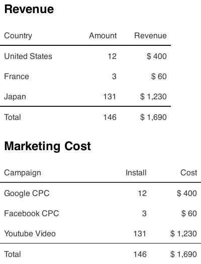

# Multiple Tables

To render multiple tables, pass an array of table objects to the renderTable function.



```javascript
import path from 'path';
import TableRenderer, { saveImage } from '../../src';

const canvas = renderTable([
	{
		title: 'Revenue',
		columns: [
			{ width: 140, title: 'Country', dataIndex: 'country' },
			{ width: 100, title: 'Amount', dataIndex: 'amount', align: 'right' },
			{ width: 100, title: 'Revenue', dataIndex: 'revenue', align: 'right' },
		],
		dataSource: [
			'-',
			{ country: 'United States', amount: '12', revenue: '$ 400' },
			{ country: 'France', amount: '3', revenue: '$ 60' },
			{ country: 'Japan', amount: '131', revenue: '$ 1,230' },
			'-',
			{ country: 'Total', amount: '146', revenue: '$ 1,690' },
		],
	},
	{
		title: 'Marketing Cost',
		columns: [
			{ width: 200, title: 'Campaign', dataIndex: 'campaign' },
			{ width: 100, title: 'Install', dataIndex: 'install', align: 'right' },
			{ width: 100, title: 'Cost', dataIndex: 'cost', align: 'right' },
		],
		dataSource: [
			'-',
			{ campaign: 'Google CPC', install: '12', cost: '$ 400' },
			{ campaign: 'Facebook CPC', install: '3', cost: '$ 60' },
			{ campaign: 'Youtube Video', install: '131', cost: '$ 1,230' },
			'-',
			{ campaign: 'Total', install: '146', cost: '$ 1,690' },
		],
	},
]);

saveImage(canvas, path.join(__dirname, 'multiple-tables.png'));
```
